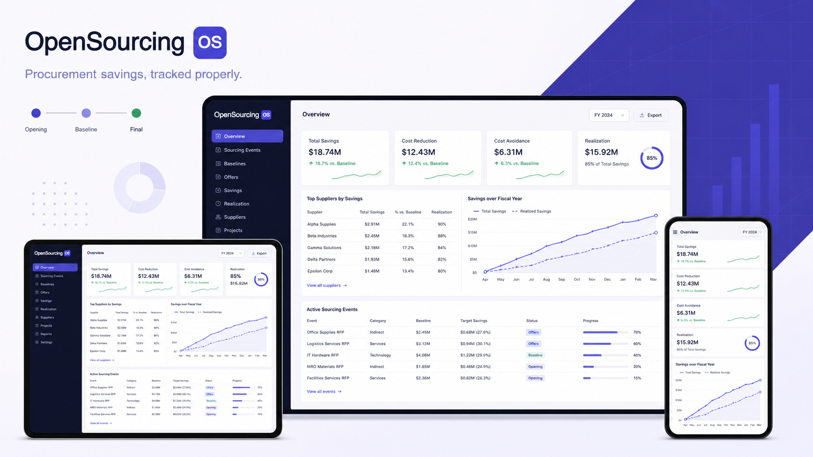

# OpenSourcingOS

Procurement savings, tracked properly.



_Product direction concept; the screens illustrate the experience this public
beta is working toward._

OpenSourcingOS is a public-beta procurement value tracker for sourcing projects,
workspace controls, supplier management, savings schedules, fiscal-year
reporting, and portfolio analysis. It is designed around one question: can every
reported savings figure be traced back to the commercial anchors that produced
it?

[Try the hosted demo](https://opensourcingos.com/login) ·
[Report a security issue](SECURITY.md) ·
[Contribute](CONTRIBUTING.md)

## What it does

- Tracks sourcing and non-commercial support projects in one portfolio.
- Lets administrators govern Support projects and the optional project
  description, owner, Cost Center, Category, and Business Unit fields without removing
  historical data.
- Lets administrators manage the Event Type, Status, Owner, Category,
  Business Unit, and Cost Center choices used by project forms.
- Tracks project due dates and dated updates alongside each project's commercial
  record.
- Records scope lines, baselines, supplier offers, and final awards.
- Maintains editable supplier records and profiles covering sourcing history,
  awards, savings, realization, status, risk, preference, and diversity.
- Configures workspace identity, reporting defaults, and savings-methodology
  controls through settings reserved for workspace administrators.
- Separates Cost Reduction from Cost Avoidance without losing the total deal
  movement.
- Normalizes offers with different terms onto a comparable monthly basis.
- Books monthly, annual, or one-time savings schedules without changing the
  total economics.
- Attributes savings to the correct calendar year, including periods spanning
  year boundaries.
- Separates forecast savings from contracted and realized results.
- Produces dashboard, supplier, project, savings, and fiscal-year reporting.
- Gives every demo user a private workspace with isolated sample data.

## The savings methodology

The application uses three commercial anchors:

```text
Opening proposal → Baseline → Final offer
```

```text
Cost Reduction = Baseline − Final
Cost Avoidance = Opening − Baseline
Total Savings  = Opening − Final
               = Cost Reduction + Cost Avoidance
```

The total cannot be changed by choosing a more flattering baseline. A missing
baseline makes Cost Reduction not applicable rather than zero. A real cost
increase remains negative and is never relabeled as savings. Hard Cost
Reduction requires a baseline grounded in the organization's own spend unless
an explicit override is recorded.

All screens use [`lib/savings/index.ts`](lib/savings/index.ts) as the single
source of truth. The executable methodology suite currently covers 340 checks.

## Try the demo

Visit [opensourcingos.com](https://opensourcingos.com/login)
and continue with Google. A first sign-in creates a private workspace and copies
in example projects. Changes made in one workspace are not visible to another
user.

The demo is for exploration and feedback. It is not yet presented as a hosted
production service or a system of record for confidential procurement data.

## Technology

- Next.js 16 and React 19
- TypeScript
- Supabase Auth and PostgreSQL
- PostgreSQL Row Level Security for workspace isolation
- Tailwind CSS
- Recharts
- Vercel deployment

## Run the application locally

### Requirements

- Node.js 20.9 or newer
- npm
- Supabase CLI 2.110.0
- Docker Desktop or Podman for the local database

### Setup

```bash
git clone https://github.com/gruvyo/opensourcingos.git
cd opensourcingos
npm ci
cp .env.example .env.local
npm run db:start
npm run db:reset
npm run db:test
npm run db:types
```

Run `supabase status`, then fill in `.env.local` with the local API URL and
modern publishable key. Start the development server:

```bash
npm run dev
```

Open [http://localhost:3000](http://localhost:3000).

The public landing page and database tests work without OAuth credentials.
Google sign-in needs your own local provider configuration; follow
[`supabase/README.md`](supabase/README.md#google-sign-in).

`NEXT_PUBLIC_SUPABASE_ANON_KEY` retains its historical name because the
Supabase client reads it throughout the application. Its value should be a
modern `sb_publishable_...` key. Never place a secret or service-role key in a
`NEXT_PUBLIC_` variable.

## Database status

[`supabase/schema.sql`](supabase/schema.sql) is a structure-only snapshot of the
live `public` schema. It includes tables, functions, Row Level Security,
policies, and grants. Reviewed forward migrations live under
[`supabase/migrations`](supabase/migrations). See
[`supabase/README.md`](supabase/README.md) before changing either.

[`lib/database.types.ts`](lib/database.types.ts) is generated from the rebuilt
local database with `npm run db:types`. It contains schema types only—no data or
credentials—and CI verifies that it remains synchronized with the migrations.

The repository now packages a reviewed foundational migration, the missing
signup trigger on `auth.users`, fictional local seed data, and database security
tests. A clean `npm run db:reset` rebuilds the local database from scratch.
Hosted setup still requires the deployer's own Google OAuth configuration and
must follow the production safeguards in [`supabase/README.md`](supabase/README.md).

## Verification

Run the money-methodology suite:

```bash
npm run verify
```

Run TypeScript checking:

```bash
npx tsc --noEmit
```

Run linting:

```bash
npm run lint
```

The methodology, TypeScript, and lint checks pass on `main`. Savings-related
changes should always run the complete methodology suite before review.

## Security model

- Every business table in the exposed `public` schema has Row Level Security.
- Policies scope business rows to the signed-in user's organization.
- New demo users receive separate organizations and separately cloned data.
- Browser users cannot invoke the privileged workspace-cloning function.
- Legacy Supabase JWT keys are disabled; the frontend uses a modern publishable
  key.
- GitHub secret scanning and push protection are enabled.

Please report suspected vulnerabilities privately as described in
[`SECURITY.md`](SECURITY.md).

## Project status

OpenSourcingOS is an MVP and public beta. The core savings methodology,
workspace isolation, Google sign-in, schedules, fiscal-year reporting,
accessibility foundations, and desktop/mobile browser journeys are working.
Current priorities are:

1. Preserve methodology traceability, workspace isolation, accessibility, and
   cross-browser confidence as the product evolves.
2. Complete workspace governance with broader module and optional-field
   controls, membership administration, audit visibility, and
   workspace-managed selection lists.
3. Expand dashboards, collaboration workflows, and supplier performance, risk,
   certification, duplicate-management, and reporting capabilities.

## Contributing

Contributions are welcome. Start with [`CONTRIBUTING.md`](CONTRIBUTING.md), run
the methodology suite before submitting savings-related changes, and keep
security reports out of public issues.

## License

OpenSourcingOS is licensed under the [Apache License 2.0](LICENSE).
